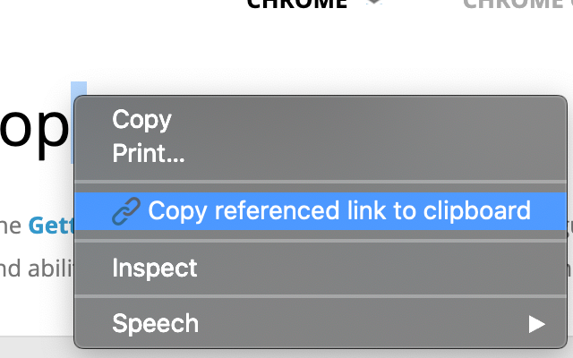

# link-reference-copy-extension

A browser extension that adds an option to the context menu (right-click menu) to immediately copy a link to the section as an anchor reference/link, i.e. https://github.com/rassek96/link-reference-copy-extension#user-content-link-reference-copy-extension.   



### Building

To install dependencies, run:
```
yarn
```

Then to build, run:
```
yarn build
```

### Credit

<div>Icons made by <a href="https://www.flaticon.com/authors/creaticca-creative-agency" title="Creaticca Creative Agency">Creaticca Creative Agency</a> from <a href="https://www.flaticon.com/" 			    title="Flaticon">www.flaticon.com</a> is licensed by <a href="http://creativecommons.org/licenses/by/3.0/" 			    title="Creative Commons BY 3.0" target="_blank">CC 3.0 BY</a></div>
